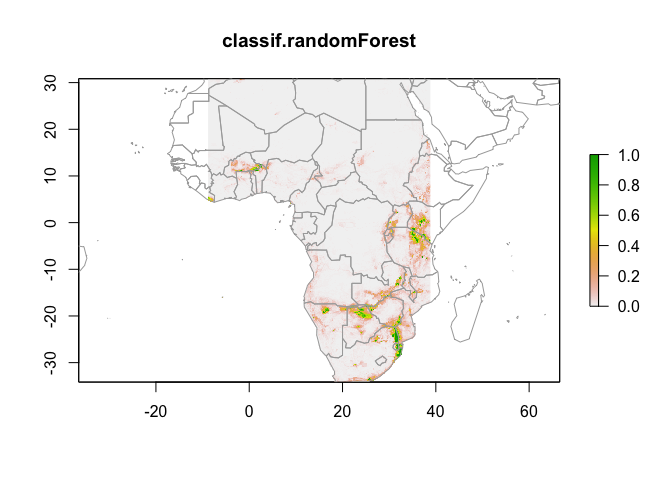

<!-- README.md is generated from README.Rmd. Please edit that file -->
[](https://travis-ci.org/boyanangelov/sdmbench)
[](https://zenodo.org/badge/latestdoi/138335161)

sdmbench
========


Species Distribution Modeling (SDM) is a field of increasing importance
in ecology<sup>[1](#footnote1)</sup>. Several popular applications of
SDMs are understanding climate change effects on
species<sup>[2](#footnote2)</sup>, natural reserve
planning<sup>[3](#footnote3)</sup> and invasive species
monitoring<sup>[4](#footnote4)</sup>. The `sdmbench` package solves
several issues related to the development and evaluation of those models
by providing a consistent benchmarking workflow:

-   consistent species occurence data acquisition and preprocessing
-   consistent environmental data acquisition and preprocessing (both
    current data and future projections)
-   consistent spatial data partitioning
-   integration of a wide variety of machine learning models
-   graphical user interface for non/semi-technical users

The end result of a `sdmbench` SDM analysis is to determine the model -
data processing combination that results in the highest predictive power
for the species of interest. Such an analysis is useful to researchers
who want to avoid issues of model selection and evaluation, and want to
rapidly test prototypes of species distribution models.

Installation
------------

``` r
# add build_vignettes = TRUE if you want the package vignette
devtools::install_github("boyanangelov/sdmbench")
```

There are several additional packages you need to install if you want to
access the complete sdmbench functionality. First Tensorflow. You can
use the `keras` package to install that (it is installed by the previous
command). Note that this step requires a working Python installation on
your system. Most modern operating systems have Python pre-installed,
but if you are not sure you can check the [official
website](https://www.python.org/).

``` r
# consult the keras documentation if you want GPU support
keras::install_keras(tensorflow = "default")
```

Additionally you will need MaxEnt. Installation instructions are
available
[here](https://www.rdocumentation.org/packages/dismo/versions/1.1-4/topics/maxent).
Note that this requires Java which you can get get from
[here](http://www.oracle.com/technetwork/java/javase/downloads/index.html).

Examples
--------

Here are several examples of what you can do with `sdmbench`.
Downloading and prepare benchmarking data:

``` r
library(sdmbench)
#> sdmbench: Tools for benchmarking Species Distribution Models 
#> ============================================================
#> For more information visit http://github.com/ 
#> To start the GUI: run_sdmbench()

benchmarking_data <- get_benchmarking_data("Loxodonta africana", limit = 1200, climate_resolution = 10)
#> [1] "Getting benchmarking data...."
#> [1] "Cleaning benchmarking data...."
#> Assuming 'decimalLatitude' is latitude
#> Assuming 'decimalLongitude' is longitude
#> Assuming 'latitude' is latitude
#> Assuming 'longitude' is longitude
#> Assuming 'latitude' is latitude
#> Assuming 'longitude' is longitude
#> [1] "Done!"
head(benchmarking_data$df_data)
#>   bio1 bio2 bio3 bio4 bio5 bio6 bio7 bio8 bio9 bio10 bio11 bio12 bio13
#> 1  219  133   57 3302  317   86  231  257  172   257   172   516   103
#> 2  225  171   60 3677  347   64  283  251  171   262   171   427   111
#> 3  178  162   81  562  278   80  198  185  175   185   171   721   133
#> 4  178  162   81  562  278   80  198  185  175   185   171   721   133
#> 5  206  105   59 2413  287  110  177  235  173   235   173   896   124
#> 6  224  136   56 3476  328   87  241  264  174   264   174   519    94
#>   bio14 bio15 bio16 bio17 bio18 bio19 label
#> 1     5    80   284    16   284    16     1
#> 2     0   109   287     1   193     1     1
#> 3    22    54   274    89   274   145     1
#> 4    22    54   274    89   274   145     1
#> 5    29    45   339    96   339    96     1
#> 6     5    78   273    20   273    20     1
```

Preparing data for benchmarking (i.e. add a spatial partitioning
method):

``` r
data("wrld_simpl", package = "maptools")
benchmarking_data$df_data <- partition_data(dataset_raster = benchmarking_data$raster_data,
                                            dataset = benchmarking_data$df_data,
                                            env = benchmarking_data$raster_data$climate_variables,
                                            method = "block")

learners <- list(mlr::makeLearner("classif.randomForest", predict.type = "prob"),
                 mlr::makeLearner("classif.logreg", predict.type = "prob"),
                 mlr::makeLearner("classif.rpart", predict.type = "prob"),
                 mlr::makeLearner("classif.ksvm", predict.type = "prob"))
benchmarking_data$df_data <- na.omit(benchmarking_data$df_data)
```

Benchmarking machine learning models on parsed species occurence data:

``` r
bmr <- benchmark_sdm(benchmarking_data$df_data, 
                     learners = learners, 
                     dataset_type = "block", 
                     sample = FALSE)
best_results <- get_best_model_results(bmr)
best_results
#> # A tibble: 4 x 3
#> # Groups:   learner.id [4]
#>   learner.id            iter   auc
#>   <fct>                <int> <dbl>
#> 1 classif.randomForest     3 0.823
#> 2 classif.logreg           3 0.540
#> 3 classif.rpart            3 0.684
#> 4 classif.ksvm             1 0.886
```

Plot best model results:

``` r
bmr_models <- mlr::getBMRModels(bmr)
plot_sdm_map(raster_data = benchmarking_data$raster_data,
            bmr_models = bmr_models,
            model_id = best_results$learner.id[1],
            model_iteration = best_results$iter[1],
             map_type = "static") +
            raster::plot(wrld_simpl, 
                         add = TRUE, 
                         border = "darkgrey")
```



    #> integer(0)

A good starting point to discover the full package functionality is to
start the GUI with `run_sdmbench()`. Here are some screenshots:

 <br> <br>


Vignette
--------

A thorough introduction to the package is available as a vignette in the
package, and
[online](https://boyanangelov.com/materials/sdmbench_vignette.html).

``` r
# open vignette
vignette("sdmbench")
```

Tests
-----

The package tests are in the `tests` directory, and can be run by using
`devtools::test` or Ctrl/Cmd + Shift + T within RStudio.

Contributors
------------

Contributions are welcome and guidelines are stated in
`CONTRIBUTING.md`.

License
-------

MIT (`LICENSE.md`)

References
----------

<a name="footnote1">1</a>. Elith, J. & Leathwick, J. R. Species
Distribution Models: Ecological Explanation and Prediction Across Space
and Time. Annu. Rev. Ecol. Evol. Syst. 40, 677–697 (2009).

<a name="footnote2">2</a>. Austin, M. P. & Van Niel, K. P. Improving
species distribution models for climate change studies: Variable
selection and scale. J. Biogeogr. 38, 1–8 (2011).

<a name="footnote3">3</a>. Guisan, A. et al. Predicting species
distributions for conservation decisions. Ecol. Lett. 16, 1424–1435
(2013).

<a name="footnote4">4</a>. Descombes, P. et al. Monitoring and
distribution modelling of invasive species along riverine habitats at
very high resolution. Biol. Invasions 18, 3665–3679 (2016).
