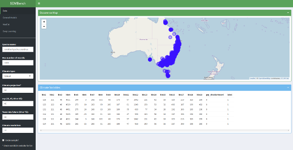
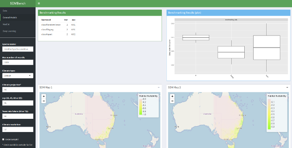

## sdmbench

Species Distribution Modeling (SDM) is a field of increasing importance in ecology. Several popular applications of SDMs are understanding climate change effects on species, natural reserve planning and invasive species monitoring. The `sdmbench` package solves several issues related to the development and evaluation of those models by providing a consistent benchmarking workflow:

* consistent species occurence data acquisition and preprocessing
* consistent environmental data acquisition and preprocessing
* consistent spatial data partitioning
* integration of a wide variety of machine learning models
* graphical user interface for non/semi-technical users

The end result of a `sdmbench` SDM analysis is to determine the model - data processing combination that results in the highest predictive power for the species of interest.

## Installation

```r
# add build_vignettes = TRUE if you want the package vignette
devtools::install_github("boyanangelov/sdmbench") 
library(sdmbench)
```

A good starting point to discover the package functionality is to start the GUI:

```r
# start browser-based GUI
run_sdmbench()
```

GUI screenshots:


&nbsp;


## Vignette

A thorough introduction to the package is available as a vignette in the package, and [online](https://boyanangelov.com/materials/sdmbench_vignette.html).

```r
# open vignette
vignette("sdmbench")
```

## Tests

The package tests are in the `tests` directory, and can be run by using `devtools::test` or Ctrl/Cmd + Shift + T within RStudio.

## Contributors

Contributions are welcome and guidelines are stated in `CONTRIBUTING.md`.

## License

MIT (`LICENSE.md`)
